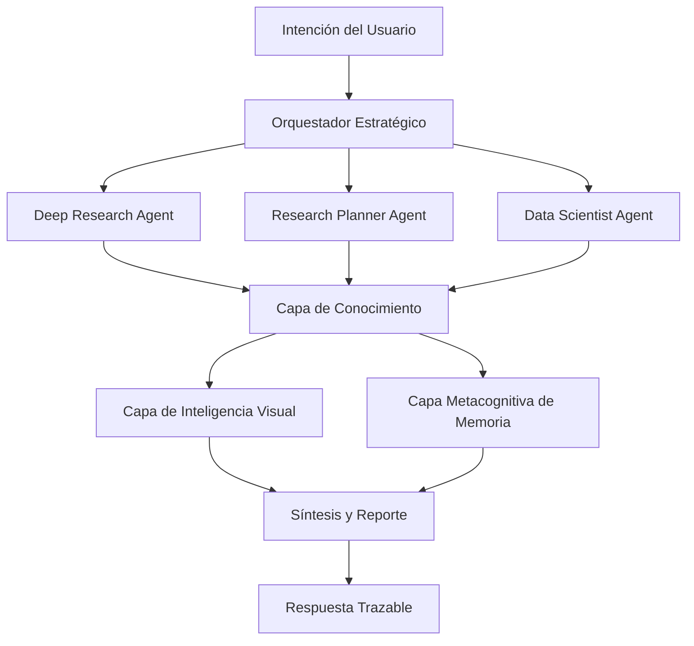

# Research Repo

**Portafolio Científico de Arquitecturas para Sistemas de Inteligencia Agéntica**

Este repositorio presenta, en formato ejecutivo y técnico, una vista de alto nivel de las arquitecturas de trabajo del ecosistema: desde el **Deep Research Agent** de Quimera hasta el **Data Scientist Agent**, incluyendo orquestación, inteligencia multimodal y gobierno de calidad.

## Resumen Ejecutivo

Los sistemas modernos de investigación con IA requieren más que recuperación de texto. Requieren agentes coordinados, evidencia trazable, interpretación multimodal y síntesis controlada. Este repositorio documenta esos patrones de diseño con enfoque científico, sin exponer detalles internos de implementación.

## Procedencia Arquitectónica

Este portafolio se deriva conceptualmente de la arquitectura del repositorio **K.I.M.E.R.A.** y abstrae sus componentes en un marco de comunicación profesional para investigación, arquitectura y due diligence técnica.

## Alcance

- Describir la arquitectura y su racional técnico.
- Explicar roles, límites y colaboración entre agentes.
- Mapear familias de herramientas por subsistema.
- Definir criterios de calidad, trazabilidad y gobernanza.
- Evitar exposición de funciones específicas o lógica propietaria de bajo nivel.

## Vista General del Sistema



## Portafolio de Agentes

| Componente | Misión Principal | Salida Esperada |
| --- | --- | --- |
| Orquestador Estratégico | Enrutar solicitudes complejas al agente especializado correcto | Ruta de ejecución unificada |
| Deep Research Agent | Exploración autónoma web y adquisición de evidencia | Paquetes de evidencia estructurada |
| Research Planner Agent | Planificación multi-fase e iterativa para análisis exhaustivos | Briefs de investigación integrales |
| Data Scientist Agent | Ejecución analítica sobre datos locales/estructurados | Reportes analíticos reproducibles |
| Capa de Inteligencia Visual | Interpretación de gráficos, diagramas y figuras | Evidencia visual de alta señal |
| Capa Metacognitiva | Persistir y reutilizar trazas de razonamiento | Contexto enriquecido para decisiones futuras |

## Ciclo de Investigación

1. Delimitación del problema e intención.
2. Adquisición de evidencia multi-fuente.
3. Análisis de brechas e iteración dirigida.
4. Síntesis técnica con control de consistencia.
5. Reporte final con estándares de procedencia.

## Estructura del Repositorio

```text
Research-Repo/
├── README.md
├── CONTRIBUTING.md
├── LICENSE
├── docs/
│   ├── ARCHITECTURE.md
│   ├── AGENTS.md
│   ├── TOOLING_MAP.md
│   └── GOVERNANCE.md
```

## Posicionamiento Profesional

Este repositorio está diseñado para:

- Líderes de investigación y arquitectura.
- Revisiones de arquitectura y due diligence técnica.
- Alineación entre ciencia, producto e ingeniería.
- Comunicación pública profesional de madurez arquitectónica.

## Cita Sugerida

> Author/Team. *Research Repo: Portafolio Científico de Arquitecturas para Sistemas de Inteligencia Agéntica*. 2026.

