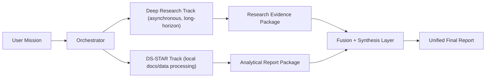

# Research Repo

**Scientific Architecture Portfolio for K.I.M.E.R.A. and DS-STAR**

> **Status:** Research Preview (WIP)  
> **Maturity:** Core agents validated individually, collaborative multi-agent flow in active integration.

## What is K.I.M.E.R.A.?

**K.I.M.E.R.A.** stands for **Knowledge Intelligent Multimodal Entity Retrieval Assistant**.
It is a GraphRAG-centered research and technical analysis architecture designed for grounded synthesis, multimodal evidence integration, and persistent reasoning memory.

## Research Motivation

This project focuses on problems where standard assistants fail:

1. Long-horizon task planning under uncertainty.
2. Multi-source synthesis with low hallucination tolerance.
3. Multi-step reasoning across text, tables, and visual artifacts.
4. Cross-session continuity and self-correction.

## Abstract

K.I.M.E.R.A. and DS-STAR are presented as a research-preview architecture for high-rigor, human-supervised autonomous analysis. The system combines GraphRAG retrieval (seed + graph expansion), multimodal evidence grounding (OCR + semantic visual ranking), and recursive agentic workflows for planning, verification, and synthesis. The operational design follows a parallel strategy: Deep Research handles long-horizon external intelligence acquisition, while DS-STAR concurrently processes local repositories and analytical workloads; both streams are fused into a unified report with explicit assumptions, source traceability, and quantitative artifacts.

The central hypothesis is that reliability gains in reasoning systems are cumulative: each validated improvement in planning control, memory structure, and verification policy increases the quality of subsequent iterations. Under this view, the architecture is optimized not only for immediate task performance, but for compounding capability development across domains where first-principles reasoning is critical, including mathematics, AI systems engineering, and scientific research.

## Current System State (Honest Snapshot)

This repository reflects an architecture with strong working components, but incomplete end-to-end collaboration.

- `Working`: Research subsystem (GraphRAG + deep research).
- `Working`: DS-STAR subsystem (iterative analytical loop).
- `Working`: Multimodal retrieval and visual interpretation.
- `In progress`: Unified collaborative flow (`Deep Research || DS-STAR -> Fusion -> Final synthesis`).
- `In progress`: Full metacognitive procedural memory in production flow.
- `Pending`: Formal reproducible benchmarking report.

If you evaluate this project, treat it as a high-rigor **research preview**, not a finished production benchmark release.

## DS-STAR Positioning

DS-STAR is positioned as a **Recursive Agentic Architecture for Data Science Workflows**, not just a script runner.

Core objective:

- Use a slow, deliberate planning loop for reasoning-heavy decisions.
- Use fast execution loops for code/action.
- Reconcile both via verification and routing.

This split addresses a known pain point in current models: **Long-Horizon Task Planning** and logic validation before execution.

## Planner-Executor Mental Model


## Parallel Collaboration Strategy (Updated)

Deep Research and DS-STAR are intentionally modeled as **decoupled parallel tracks**, not a strict serial dependency.



Rationale:

- Deep Research may require long execution windows for quality.
- DS-STAR can progress in parallel on local repositories and structured/unstructured files.
- Fusion happens when one or both tracks produce usable artifacts.

## Core Reasoning Concepts

The architecture explicitly targets:

- **Multi-step Reasoning**
- **Chain-of-Thought (CoT) Verification**
- **Self-Correction Loops**
- **Autonomous Planning Horizons**
- **First-Principles Thinking**

## Mathematical Backbone (Summary)

1. PageRank for core concept prioritization:

$$
PR(v_i) = \frac{1-d}{N} + d \sum_{v_j \in M(v_i)} \frac{PR(v_j)}{L(v_j)}
$$

2. Personalized PageRank for hierarchical retrieval:

$$
\vec{p} = (1-c)A\vec{p} + c\vec{u}
$$

3. Cosine similarity for semantic ranking:

$$
\text{Sim}(A, B) = \frac{A \cdot B}{\|A\|\|B\|}
$$

4. Modularity optimization (Leiden communities):

$$
Q = \frac{1}{2m} \sum_{ij} \left(A_{ij} - \frac{k_i k_j}{2m}\right)\delta(c_i, c_j)
$$

See `docs/MATHEMATICAL_FOUNDATIONS.md` for full context.

## Textual Citations (Primary Sources)

> "K.I.M.E.R.A. (**Knowledge Intelligent Multimodal Entity Retrieval Assistant**) es un sistema de GraphRAG (Retrieval-Augmented Generation basado en Grafos de Conocimiento) diseñado para investigación científica y análisis técnico." [1]

> "El **Research Planner Agent** es un orquestador que implementa el patrón **Explore -> Plan -> Batch -> Audit -> Synthesize** para generar reportes de investigación exhaustivos." [2]

> "K.I.M.E.R.A. V5-V6 implementa un sistema **tricameral** de inteligencia artificial." [3]

> "DS-STAR doesn't \"struggle\" with documents. It employs a **Librarian Protocol** to map, index, and semantically retrieve data across multimodal assets." [4]

> "**Purpose**: To retrieve global context by flowing probability through the graph structure, solving the \"disconnected chunk\" problem of Vector RAG." [5]

Full references and citation mapping: `docs/PRIMARY_SOURCES.md`.

## Academic Lineage and Research Positioning

This repository explicitly traces its design lineage to peer-reviewed and preprint research in:

- agentic data-science workflows (DS-STAR, MLE-STAR),
- multi-agent scientific reasoning (AI co-scientist),
- advanced GraphRAG paradigms (GraphRAG, HippoRAG, hierarchical RAG),
- metacognitive and memory-augmented agents (Reflexion, ToT, GoT, MemGPT),
- graph-native query systems and graph analytics (Cypher, Leiden).

See `docs/ACADEMIC_LINEAGE.md` for curated references and implementation mapping.

## Evaluation Posture

Current status:

- Formal comparative benchmark suite: **pending**.
- Operational evidence: **available** (integration tests, mission traces, telemetry, synthesis reports).

This repository intentionally avoids fabricated performance claims.

See `docs/EVALUATION.md` and `benchmarks/theoretical_reasoning.md`.

Implementation and benchmark execution plan: `docs/INTEGRATION_BENCHMARK_PLAN.md`.
Engineering and MLOps standards: `docs/ENGINEERING_STANDARDS.md`.

## Repository Structure

```text
Research-Repo/
├── README.md
├── CITATION.cff
├── evaluation_metrics.py
├── benchmarks/
│   └── theoretical_reasoning.md
├── reasoning_traces_logs/
│   ├── .gitkeep
│   └── README.md
└── docs/
    ├── ACADEMIC_LINEAGE.md
    ├── AGENTS.md
    ├── ARCHITECTURE.md
    ├── CAPABILITIES.md
    ├── ENGINEERING_STANDARDS.md
    ├── EVALUATION.md
    ├── GOVERNANCE.md
    ├── INTEGRATION_BENCHMARK_PLAN.md
    ├── MATHEMATICAL_FOUNDATIONS.md
    ├── PRIMARY_SOURCES.md
    ├── ROADMAP.md
    └── TOOLING_MAP.md
```

## References

[1] `Docs/ARCHIVE (Research artifacts)/KIMERA_CURRENT_STATE.md`
[2] `Docs/1-Agents/RESEARCH_PLANNER.md`
[3] `Docs/0-Architecture/CORE_V5_V6_METACOGNITION.md`
[4] `Docs/2-Intelligence/LOCAL_DATA_RESEARCH.md`
[5] `Docs/ALGORITHMS.md`
