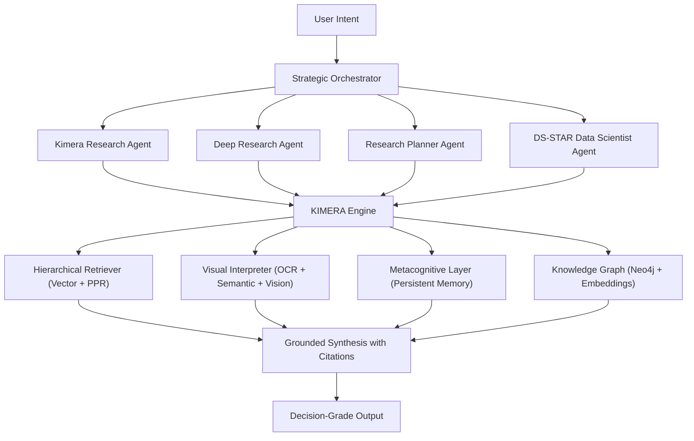

# Research Repo

**Portafolio Cientifico de Arquitectura para K.I.M.E.R.A.**

## Que es K.I.M.E.R.A.

**K.I.M.E.R.A.** significa **Knowledge Intelligent Multimodal Entity Retrieval Assistant**.
Es un sistema de investigacion y analitica tecnica basado en GraphRAG, agentes especializados y memoria metacognitiva.

Su objetivo no es solo responder preguntas, sino producir **respuestas trazables** con evidencia, citas y control de calidad.

## Problema que Resuelve

Los pipelines RAG tradicionales suelen fallar en tres frentes:

1. Recuperan contexto local pero no relaciones globales entre fuentes.
2. Tratan texto e imagen como mundos separados.
3. Pierden aprendizaje entre sesiones.

K.I.M.E.R.A. aborda esto con:

- retrieval jerarquico sobre grafo (no solo top-k vectorial),
- inteligencia multimodal (texto + visual),
- capas metacognitivas para continuidad inter-sesion.

## Que tareas puede hacer Quimera

K.I.M.E.R.A. puede operar como motor de investigacion y como sistema de ciencia de datos:

- Deep web research multi-fase: explorar, planear, ejecutar sub-queries y sintetizar.
- Construccion y consulta de grafos de conocimiento con citas.
- Analisis de documentos locales (PDF, reportes, imagenes, tablas complejas).
- Analisis de datos estructurados (CSV, Excel, parquet, JSON, DB) con rigor reproducible.
- Interpretacion de graficas y figuras mediante capa de vision.
- Deteccion de gaps de conocimiento y refinamiento iterativo.

## Vista General del Sistema



## Fundamentos Matematicos (Resumen)

El motor utiliza tecnicas clasicas de teoria de grafos y recuperacion semantica:

1. PageRank para priorizar conceptos nucleares durante ingesta:

$$
PR(v_i) = \\frac{1-d}{N} + d \\sum_{v_j \\in M(v_i)} \\frac{PR(v_j)}{L(v_j)}
$$

2. Personalized PageRank para expansion jerarquica de contexto:

$$
\\vec{p} = (1-c)A\\vec{p} + c\\vec{u}
$$

3. Similaridad coseno para matching texto-texto y texto-imagen:

$$
\\text{Sim}(A, B) = \\frac{A \\cdot B}{\\|A\\|\\|B\\|}
$$

4. Modularidad para deteccion de comunidades (Leiden):

$$
Q = \\frac{1}{2m} \\sum_{ij} \\left(A_{ij} - \\frac{k_i k_j}{2m}\\right)\\delta(c_i, c_j)
$$

Mas detalle: `docs/MATHEMATICAL_FOUNDATIONS.md`.

## Capacidades por Capa

| Capa | Capacidad principal | Resultado |
| --- | --- | --- |
| Orquestacion | Enrutamiento de intencion y seleccion de estrategia | Flujo de ejecucion correcto |
| Investigacion profunda | Adquisicion web + deduplicacion semantica | Evidencia multi-fuente |
| Ciencia de datos (DS-STAR) | Plan -> Codigo -> Verificacion -> Correccion | Analisis reproducible |
| Retrieval GraphRAG | Seed semantico + expansion PPR | Contexto global y local |
| Vision | OCR + ranking multimodal + analisis visual | Insights de graficas y tablas |
| Memoria metacognitiva | Persistencia de trazas y anti-patrones | Mejora inter-sesion |

## Evaluacion, Benchmarks y Limitaciones

Estado actual:

- **Benchmark formal comparativo**: pendiente.
- **Evidencia empirica disponible**: extensa (misiones ejecutadas, trazas, reportes, telemetria por fase, pruebas de integracion).

En vez de reportar metricas no verificadas, el repositorio sigue un enfoque de evidencia honesta:

1. Reportar lo medido operacionalmente.
2. Declarar explicitamente lo que aun no esta benchmarkeado.
3. Mantener un plan reproducible para evaluacion futura.

Dimensiones de evaluacion recomendadas:

- groundedness y trazabilidad de hallazgos,
- cobertura de fuentes y contexto recuperado,
- redundancia semantica post-sintesis,
- estabilidad del ciclo multi-agente,
- latencia y costo relativo por modo de investigacion.

Limitaciones conocidas:

- Dependencia de calidad y disponibilidad de fuentes externas.
- Sensibilidad a rate limits y cuotas de proveedores de modelo/API.
- Variabilidad de extraccion en documentos PDF complejos.
- Mayor latencia/costo en modos de investigacion profunda.
- Requiere validacion humana para decisiones de alto impacto.

Mas detalle: `docs/EVALUATION.md`.

## Estructura del Repositorio

```text
Research-Repo/
├── README.md
├── CONTRIBUTING.md
├── LICENSE
└── docs/
    ├── ARCHITECTURE.md
    ├── AGENTS.md
    ├── CAPABILITIES.md
    ├── EVALUATION.md
    ├── GOVERNANCE.md
    ├── MATHEMATICAL_FOUNDATIONS.md
    └── TOOLING_MAP.md
```

## Alcance y Limites

- Este repo explica arquitectura, no detalles propietarios de implementacion.
- Se prioriza claridad para evaluacion tecnica y comunicacion ejecutiva.
- Las especificaciones son de alto nivel, pero fieles al sistema real.

## Cita Sugerida

> Author/Team. *Research Repo: Scientific Architecture Portfolio for K.I.M.E.R.A.* 2026.
