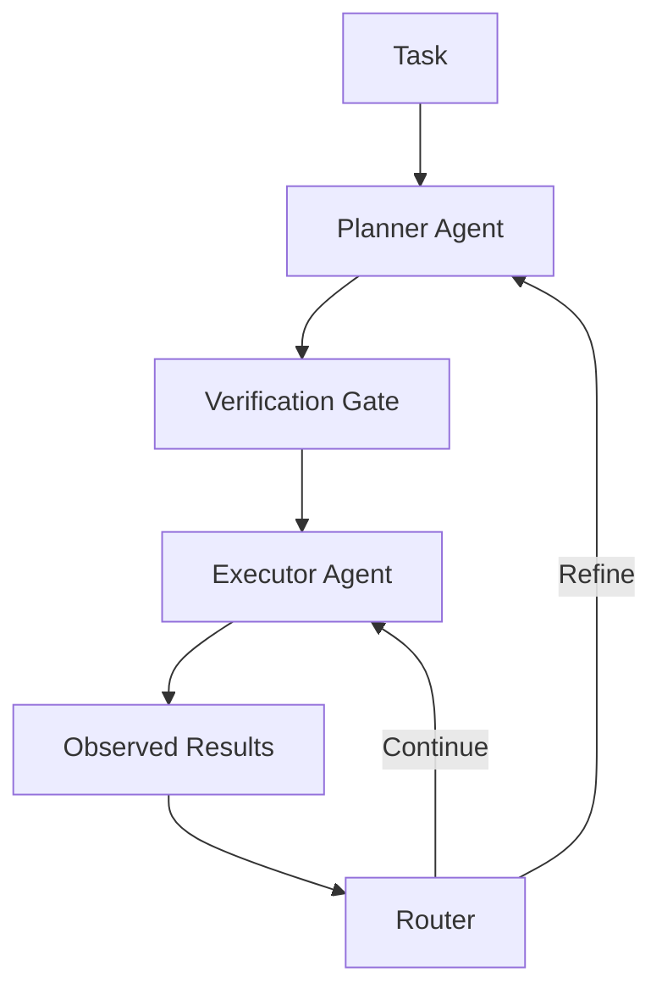

# Agent Portfolio

## 1. Strategic Orchestrator

Role:

- Interprets user intent and constraints.
- Selects the right specialist path.
- Maintains coherence between planning, execution, and synthesis.

## 2. Kimera Research Agent

Role:

- Executes GraphRAG queries on indexed knowledge.
- Retrieves structural + semantic context.
- Produces evidence packages for grounded synthesis.

## 3. Deep Research Agent

Role:

- Performs autonomous external discovery and ingestion.
- Expands evidence when local context is insufficient.
- Supports multi-query missions with lineage tracking.

## 4. Research Planner Agent

Role:

- Directs deep missions with iterative planning.
- Generates orthogonal sub-queries.
- Applies semantic deduplication before final synthesis.

Canonical workflow:

- Explore -> Plan -> Batch -> Audit -> Synthesize

## 5. DS-STAR (Recursive Agentic Architecture for Data Science Workflows)

Role:

- Plans, executes, verifies, and debugs analytical workflows.
- Uses explicit routing and self-correction when plans fail.
- Produces reproducible analysis artifacts.

Core cycle:

- Analyze -> Plan -> Code -> Verify -> Route -> Finalize

## 6. Planner-Executor Decomposition (Reasoning-Aware)

This decomposition is designed for:

- Multi-step reasoning control,
- chain-of-thought verification checkpoints,
- long-horizon planning reliability.

## 7. Vision Component

Role:

- Filters and ranks visual assets for analytical relevance.
- Extracts visual signals from charts/diagrams.
- Injects visual evidence into synthesis.

## 8. Metacognitive Component

Role:

- Persists structured reasoning traces (`Thought`, `Critique`, `AntiPattern`, etc.).
- Hydrates new sessions with relevant prior traces.
- Enables robust self-correction loops across sessions.
