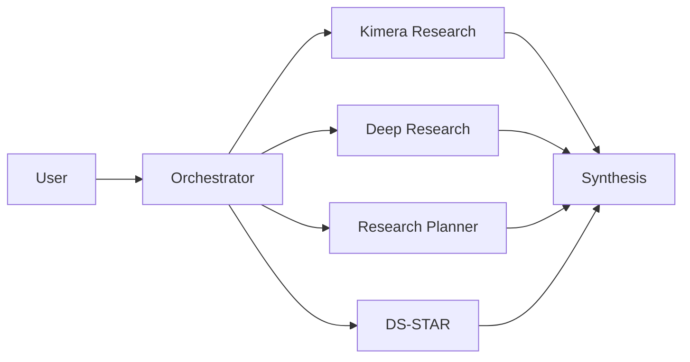

# Portafolio de Agentes

## 1. Orquestador Estrategico

**Rol**: cerebro de ruteo.

- Interpreta intencion del usuario.
- Selecciona el agente o combinacion de agentes correcta.
- Mantiene coherencia de conversacion y salida.

**Tareas tipicas**:

- Resolver preguntas directas sobre conocimiento ya indexado.
- Escalar a investigacion profunda cuando detecta complejidad.
- Derivar a DS-STAR cuando la pregunta exige analitica cuantitativa.

## 2. Kimera Research Agent

**Rol**: especialista en consulta GraphRAG.

- Opera sobre el grafo de conocimiento existente.
- Recupera contexto textual y estructural.
- Devuelve evidencia lista para sintesis.

**Tareas tipicas**:

- Responder preguntas tecnicas con soporte documental.
- Buscar relaciones entre documentos y conceptos.
- Reportar gaps cuando la evidencia es insuficiente.

## 3. Deep Research Agent

**Rol**: adquisicion web autonoma.

- Descubre fuentes externas relevantes.
- Ingiere contenido al grafo con lineage de mision.
- Puede sintetizar o dejar evidencia preparada para etapas posteriores.

**Tareas tipicas**:

- Levantar estado del arte sobre un tema nuevo.
- Actualizar un dominio tecnico con fuentes recientes.
- Construir base de evidencia para reportes ejecutivos.

## 4. Research Planner Agent

**Rol**: director de misiones de investigacion.

- Diseña estrategia multi-fase.
- Genera sub-queries ortogonales para cobertura amplia.
- Ejecuta auditoria semantica para evitar redundancia.

**Tareas tipicas**:

- Deep dives estrategicos.
- Reportes de inteligencia tecnica.
- Synthesis final con enfoque de decision.

## 5. DS-STAR Data Scientist Agent

**Rol**: analista cuantitativo autonomo con verificacion.

- Descompone tareas analiticas en pasos ejecutables.
- Genera y ejecuta codigo local.
- Verifica resultados y corrige fallas.

**Tareas tipicas**:

- Analisis financiero y forecasting.
- Segmentacion y deteccion de patrones.
- Construccion de graficas y reportes tecnicos reproducibles.

## 6. Componente de Vision

**Rol**: interpretacion de activos visuales.

- Identifica imagenes relevantes para una query.
- Extrae contexto con OCR y embeddings multimodales.
- Realiza interpretacion profunda para enriquecer la sintesis.

**Tareas tipicas**:

- Leer graficas de performance.
- Interpretar diagramas de arquitectura.
- Priorizar evidencia visual de alta densidad informativa.

## 7. Componente Metacognitivo

**Rol**: memoria y reflexion estructurada.

- Captura trazas de razonamiento durante ejecucion.
- Persiste patrones de exito/error.
- Rehidrata contexto relevante en sesiones futuras.

**Tareas tipicas**:

- Evitar repetir rutas fallidas.
- Transferir aprendizaje entre misiones.
- Mejorar calidad de planificacion y ruteo con historial.

## 8. Mapa de Interaccion

