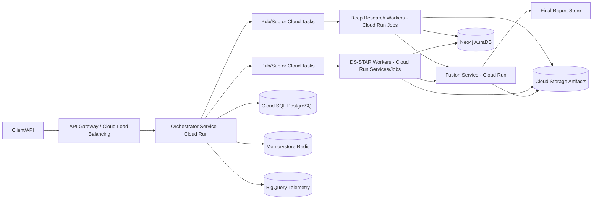

# Engineering Standards and Production Scaling

This document defines engineering and MLOps standards for moving K.I.M.E.R.A. and DS-STAR from Research Preview to production-grade operation.

The emphasis is practical: reliability, observability, reproducibility, and cost control for multi-agent workloads.

## 1. Scope and Maturity

Current state:

- Core agent tracks validated independently.
- Parallel collaboration model defined (`Deep Research || DS-STAR -> Fusion`).
- Benchmarking framework defined, full reproducible benchmark pending.

Objective:

- Standardize how the system is implemented and scaled on real infrastructure.

## 2. System Architecture Standards

### 2.1 Control Plane vs Execution Plane

Control Plane responsibilities:

1. Mission creation and routing.
2. State transitions (`PENDING -> RUNNING -> FUSION -> DONE`).
3. Queue dispatch and retry policy.
4. SLO and budget enforcement.

Execution Plane responsibilities:

1. Deep Research asynchronous runs (long horizon).
2. DS-STAR analytical runs (local/document/data processing).
3. Fusion and final synthesis stage.

### 2.2 Parallel-by-Default Mission Pattern

The default mission pattern is parallel:

1. Deep Research starts asynchronous evidence acquisition.
2. DS-STAR starts local analysis immediately.
3. Fusion merges structured handoff packages from both tracks.

This avoids blocking DS-STAR on long web-research jobs and improves time-to-first-usable-output.

### 2.3 State Externalization

Compute services must remain stateless. Mission state must be persisted externally.

Minimum persistent keys:

- `mission_id`
- `session_id`
- `knowledge_space`
- `track_status.deep_research`
- `track_status.ds_star`
- `fusion_status`
- `cost_so_far`

## 3. Real Infrastructure Blueprint (GCP-Oriented)

The following topology is recommended for production-scale operation.

Recommended mapping:

1. Orchestrator API: Cloud Run service.
2. Long-running jobs: Cloud Run Jobs (or GKE jobs if needed).
3. Queueing: Pub/Sub for event fan-out, Cloud Tasks for strict per-task retry controls.
4. Mission state: Cloud SQL PostgreSQL.
5. Low-latency coordination cache: Memorystore Redis.
6. Graph memory: Neo4j AuraDB (or managed Neo4j deployment).
7. Artifact store: Cloud Storage.
8. Telemetry warehouse: BigQuery.

## 4. Data Contracts and Defensive Interfaces

### 4.1 Strict Handoff Schemas

Agent handoff payloads must use strict schemas (Pydantic or equivalent).

Required handoff contracts:

1. `ResearchEvidencePackage`
2. `AnalyticalReportPackage`
3. `FusionInputPackage`
4. `MissionOutcomePackage`

### 4.2 Idempotency Requirements

Every track write must be idempotent by (`mission_id`, `track`, `attempt`).

Neo4j write guidance:

1. Use Cypher `MERGE` where possible.
2. Preserve `session_id` lineage.
3. Separate mission-scoped writes from global knowledge writes.

## 5. Observability and Traceability Standards

### 5.1 Telemetry Baseline

Every request/mission should emit:

1. Request ID
2. Mission ID
3. Agent track
4. Latency per phase
5. Token usage and estimated cost
6. Retry counts and error type

### 5.2 OpenTelemetry

Use OpenTelemetry spans across:

1. Orchestration
2. Queue dispatch
3. Agent execution
4. Fusion
5. Persistence writes

This is mandatory for debugging non-deterministic multi-agent behavior.

### 5.3 Reasoning Trace Policy

Store structured reasoning events (plan steps, verifier verdicts, route decisions), not uncontrolled raw dumps.

Rationale:

1. Enables evaluation and analytics.
2. Reduces sensitive leakage risk.
3. Supports reproducible diagnosis.

## 6. Reliability and SRE Standards

### 6.1 SLO Targets (Initial)

Suggested initial SLOs:

1. Mission completion success rate >= 95% (excluding upstream provider outages).
2. Orchestrator API availability >= 99.5%.
3. p95 orchestration latency < 2s (excluding long-running worker execution).

### 6.2 Retry and Failure Policy

1. Exponential backoff with jitter for provider/API failures.
2. Dead-letter queue for repeated failures.
3. Circuit-breaker for failing external dependencies.
4. Compensating actions for partial mission completion.

### 6.3 Degradation Strategy

If Deep Research is delayed:

1. DS-STAR continues.
2. Fusion emits partial report with explicit status flags.
3. Final report is upgraded when Deep Research completes.

## 7. Security and Governance

1. Secret Manager for all credentials and API keys.
2. Least-privilege IAM per service account.
3. Separate read vs write permissions for knowledge stores.
4. Input and output guardrails for prompt-injection and unsafe tool invocation.
5. Audit trail for mission-critical actions.

## 8. Cost Governance Standards

1. Per-mission spend cap.
2. Per-day global spend cap.
3. Token and tool cost attribution per track.
4. Automatic downgrade policy when budget thresholds are hit.
5. Cost-aware benchmark mode (small fixed suites first).

## 9. Reproducibility and Release Engineering

1. Deterministic dependency lockfiles.
2. Containerized runtime for each service.
3. CI checks:
   - lint
   - types
   - unit tests
   - integration smoke tests
4. Release gates:
   - no schema-breaking changes without migration plan
   - benchmark delta report for major changes

## 10. Implementation Path (Pragmatic)

### Phase A - Foundation

1. Define mission state model and handoff schemas.
2. Externalize mission state to SQL + Redis.
3. Add queue-backed async execution for Deep Research.

### Phase B - Production Telemetry

1. Instrument OpenTelemetry spans.
2. Standardize mission-level cost and latency logs.
3. Create BigQuery dashboards for reliability and cost.

### Phase C - Parallel Fusion at Scale

1. Enable asynchronous partial fusion.
2. Add deterministic report assembly.
3. Introduce queue autoscaling policies.

### Phase D - Benchmark and Hardening

1. Run mini reproducible benchmark.
2. Perform failure-mode drills.
3. Publish technical validation report.

## 11. Definition of Production-Ready (Engineering)

A release is considered production-ready when:

1. Parallel mission flow is stable under load.
2. Mission state survives restarts and retries.
3. Observability can reconstruct any failed mission end-to-end.
4. Security controls are enforced by default.
5. Cost remains bounded under defined guardrails.
