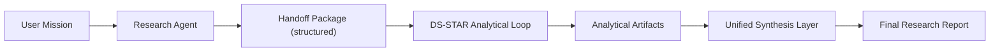

# Integration and Benchmark Plan (Preview -> Reproducible)

## 1. Objective

Move from independent-but-orchestrated agents to one collaborative mission pipeline:

1. `Research Agent`
2. `DS-STAR`
3. `Final Synthesis`

No code-level claims are made here. This document defines the execution target and acceptance criteria.

## 2. Target Mission Flow

## 3. Handoff Contract (Conceptual)

Research output must pass to DS-STAR in a structured package that includes:

1. Research question and scope.
2. Curated evidence summary.
3. Source list and confidence notes.
4. Candidate analytical hypotheses.

DS-STAR output must pass to synthesis as:

1. Analytical findings.
2. Reproducible artifact references (tables/charts/scripts if available).
3. Verification notes.
4. Limitations and uncertainty.

## 4. Definition of Done (Integration)

Integration milestone is considered done when:

1. A mission runs in one continuous pipeline from research to final report.
2. The final report includes both research evidence and quantitative analysis.
3. The final report explicitly marks assumptions and limitations.
4. At least 5 mission runs complete without manual stitching.

## 5. Minimal Reproducible Benchmark (After Integration)

### 5.1 Scope

- 10-15 fixed tasks.
- Mix of:
  - research-heavy tasks,
  - analysis-heavy tasks,
  - mixed tasks requiring both.

### 5.2 Conditions to Compare

1. Baseline A: agents run independently (manual/weak stitching).
2. Candidate B: unified collaborative pipeline.

### 5.3 Metrics

1. Groundedness.
2. Completion quality.
3. Cross-source consistency.
4. End-to-end latency.
5. Estimated cost per mission.

## 6. Cost-Constrained Execution Strategy

Given limited credits, execute in phases:

1. Pilot (3 tasks): validate pipeline stability.
2. Core run (10-15 tasks): main benchmark.
3. Repro run (same tasks, limited repeats): verify consistency.

Guardrails:

1. Hard cap per task.
2. Hard daily spend ceiling.
3. Mandatory telemetry logging.

## 7. Suggested Timeline (Pragmatic)

1. Week 1:
   - lock mission templates,
   - lock handoff schema,
   - run 3 pilot missions.
2. Week 2:
   - run full mini-benchmark,
   - compile report tables,
   - publish benchmark note as preview evidence.

## 8. Deliverables

1. Unified mission report template.
2. Benchmark task list (frozen).
3. Run log bundle (cost/latency/outcomes).
4. Short technical note with findings and limitations.
