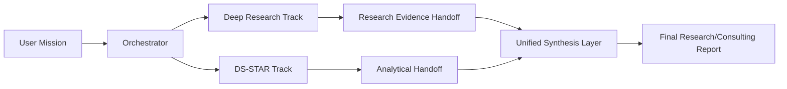

# Integration and Benchmark Plan (Preview -> Reproducible)

## 1. Objective

Move from independent-but-orchestrated agents to one collaborative mission architecture with **parallel execution**:

1. `Deep Research Track` (external intelligence, slower by design)
2. `DS-STAR Track` (local processing + analytical production)
3. `Fusion/Synthesis Track` (merges evidence and analysis)

No code-level claims are made here. This document defines the execution target and acceptance criteria.

## 2. Target Mission Flow (Parallel)

## 3. Why Parallel (Design Rationale)

1. Deep Research is inherently long-running when quality constraints are high.
2. DS-STAR can deliver value early by processing local docs/data while web research is still running.
3. Parallelism reduces idle time and enables staged deliverables.
4. Fusion can happen incrementally (partial report) or at mission close (final report).

## 4. Handoff Contract (Conceptual)

Deep Research handoff package should include:

1. Research question and scope.
2. Curated evidence summary.
3. Source list and confidence notes.
4. Candidate analytical hypotheses.

DS-STAR handoff package should include:

1. Analytical findings.
2. Reproducible artifact references (tables/charts/scripts if available).
3. Verification notes.
4. Limitations and uncertainty.

Optional cross-handoff:

1. Deep Research can provide new sources to DS-STAR for secondary processing.
2. DS-STAR can request missing evidence scopes back to Deep Research.

## 5. Definition of Done (Integration)

Integration milestone is considered done when:

1. A mission runs with both tracks active in parallel.
2. At least one mission demonstrates asynchronous handoff from Deep Research to DS-STAR.
3. The final report includes both research evidence and quantitative analysis.
4. The final report explicitly marks assumptions and limitations.
5. At least 5 mission runs complete without manual stitching.

## 6. Minimal Reproducible Benchmark (After Integration)

### 6.1 Scope

- 10-15 fixed tasks.
- Mix of:
  - research-heavy tasks,
  - analysis-heavy tasks,
  - mixed tasks requiring both.

### 6.2 Conditions to Compare

1. Baseline A: agents run independently (manual/weak stitching).
2. Candidate B: serial handoff (`Deep Research -> DS-STAR`).
3. Candidate C: parallel collaboration (`Deep Research || DS-STAR -> Fusion`).

### 6.3 Metrics

1. Groundedness.
2. Completion quality.
3. Cross-source consistency.
4. End-to-end latency.
5. Estimated cost per mission.
6. Time-to-first-usable-deliverable.

## 7. Cost-Constrained Execution Strategy

Given limited credits, execute in phases:

1. Pilot (3 tasks): validate pipeline stability.
2. Core run (10-15 tasks): main benchmark.
3. Repro run (same tasks, limited repeats): verify consistency.

Guardrails:

1. Hard cap per task.
2. Hard daily spend ceiling.
3. Mandatory telemetry logging.

## 8. Suggested Timeline (Pragmatic)

1. Week 1:
   - lock mission templates,
   - lock handoff schema,
   - run 3 pilot missions.
2. Week 2:
   - run full mini-benchmark,
   - compile report tables,
   - publish benchmark note as preview evidence.

## 9. Deliverables

1. Unified mission report template.
2. Benchmark task list (frozen).
3. Run log bundle (cost/latency/outcomes).
4. Short technical note with findings and limitations.
